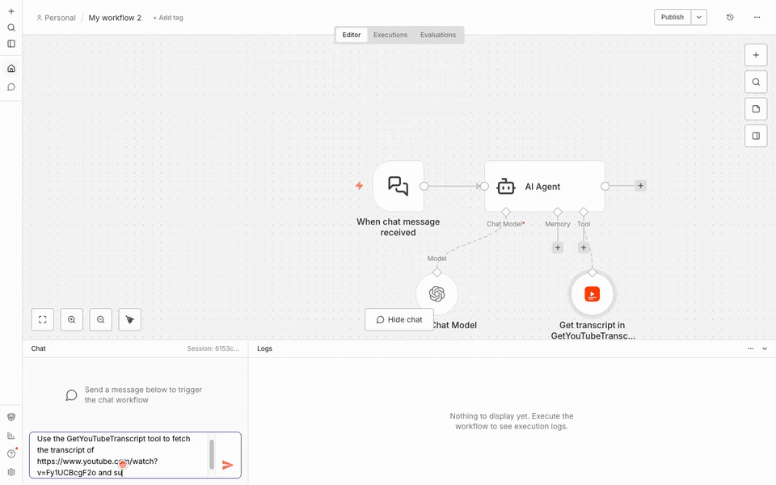

# n8n-nodes-getyoutubetranscript

An [n8n](https://n8n.io) community node for the [GetYouTubeTranscript](https://getyoutubetranscript.com) API — pull YouTube transcripts, search videos and channels, resolve channel handles, and browse channels and playlists, directly inside your n8n workflows.

[](./LICENSE)
[](https://getyoutubetranscript.com)

## Demo

An n8n AI Agent using the GetYouTubeTranscript node as a tool to fetch and summarize a video:

[](./docs/demo.mp4)

[Watch the full 2.5-minute walkthrough (with narration)](./docs/demo.mp4): installing the node from npm, creating and testing the credential, Get Transcript, Search YouTube, and using the node as an AI Agent tool.

## What this is

This package adds one node — **GetYouTubeTranscript** — with eight operations mapped to the [GetYouTubeTranscript API](https://getyoutubetranscript.com/docs):

| Operation | Endpoint | Cost |
|---|---|---|
| Get Transcript | `GET /transcript` | 1 credit |
| Search YouTube | `GET /search` | 1 credit |
| Resolve Channel | `GET /resolve` | Free |
| Get Channel Latest Videos | `GET /channel/latest` | Free |
| Search Channel Videos | `GET /channel/search` | 1 credit |
| List Channel Videos | `GET /channel/videos` | 1 credit |
| List Playlist Videos | `GET /playlist` | 1 credit |
| Get Credits | `GET /credits` | Free |

Failed and rate-limited requests are never charged. Full API reference: [getyoutubetranscript.com/docs](https://getyoutubetranscript.com/docs).

## Install

### n8n Cloud / self-hosted UI (community node install)

1. Go to **Settings → Community Nodes**.
2. Click **Install a community node**.
3. Enter `n8n-nodes-getyoutubetranscript` and confirm.

### Self-hosted, via npm

```bash
npm install n8n-nodes-getyoutubetranscript
```

Then restart your n8n instance so it picks up the new node. See [n8n's community node docs](https://docs.n8n.io/integrations/community-nodes/installation/) for environment-specific instructions (Docker, npm, etc.).

## Credentials

The node authenticates with a **GetYouTubeTranscript API** credential — a single API key field.

### Get a key from the dashboard

1. Sign up for free at [getyoutubetranscript.com](https://getyoutubetranscript.com) — 100 free credits, no card required.
2. Grab your key from the [dashboard](https://getyoutubetranscript.com/dashboard). Keys look like `sk_live_...`.
3. In n8n, create a new **GetYouTubeTranscript API** credential and paste the key in.

The credential's "Test" button calls the free `/resolve` endpoint, so validating a key never spends a credit.

### Self-serve signup (no dashboard visit)

For automated setups you can mint a key with two API calls, no browser required:

```bash
curl -X POST https://getyoutubetranscript.com/api/v1/signup \
  -H "Content-Type: application/json" \
  -d '{"email":"you@example.com"}'
# -> emails a 6-digit code, valid for 10 minutes

curl -X POST https://getyoutubetranscript.com/api/v1/signup/verify \
  -H "Content-Type: application/json" \
  -d '{"email":"you@example.com","otp":"123456"}'
# -> {"success":true,"api_key":"sk_live_..."}  (shown once - store it)
```

## Example workflow

Ready to import: [`examples/workflows/summarize-youtube-video-with-ai.json`](./examples/workflows/summarize-youtube-video-with-ai.json) fetches a video's transcript and summarizes it with OpenAI. In n8n, open a new workflow and paste the file's contents onto the canvas (or use **Import from File**), then attach your GetYouTubeTranscript and OpenAI credentials.

Another pattern, "summarize a channel's latest video":

1. **Manual Trigger** (or a Schedule/Webhook trigger with a channel handle in the payload).
2. **GetYouTubeTranscript** node, operation **Get Channel Latest Videos**, `Channel` = `@mkbhd` — returns the channel's metadata and most recent uploads.
3. A **Set** node (or expression) to pull the top video's ID out of the response.
4. A second **GetYouTubeTranscript** node, operation **Get Transcript**, `Video` = `{{$json.videos[0].id}}` — returns the full transcript.
5. Feed the transcript into an **AI/LLM node** (OpenAI, Anthropic, etc.) to summarize it.

Pagination endpoints (`Search YouTube`, `Search Channel Videos`, `List Channel Videos`, `List Playlist Videos`) return an opaque `continuation_token` / `next_page_token` in their response — wire that into a **Loop Over Items** or a manual loop, feeding it back into the `Continuation` / `Page Token` field to walk subsequent pages.

## Development

```bash
npm install
npm run build      # compiles TypeScript to dist/
npm run dev         # n8n + this node with hot reload, http://localhost:5678
npm run lint
```

### Live request test

`test/live-test.ts` is a standalone script (no n8n runtime needed) that hits the real API to confirm request construction and response parsing for a few operations:

```bash
GYT_API_KEY=sk_live_... npm run test:live
```

It calls three free endpoints (`/resolve`, `/channel/latest`, `/credits`) and one paid endpoint (`/transcript`, 1 credit) once each.

## Docs

Full API reference, error codes, and rate limits: [getyoutubetranscript.com/docs](https://getyoutubetranscript.com/docs).

## License

[MIT](./LICENSE)
